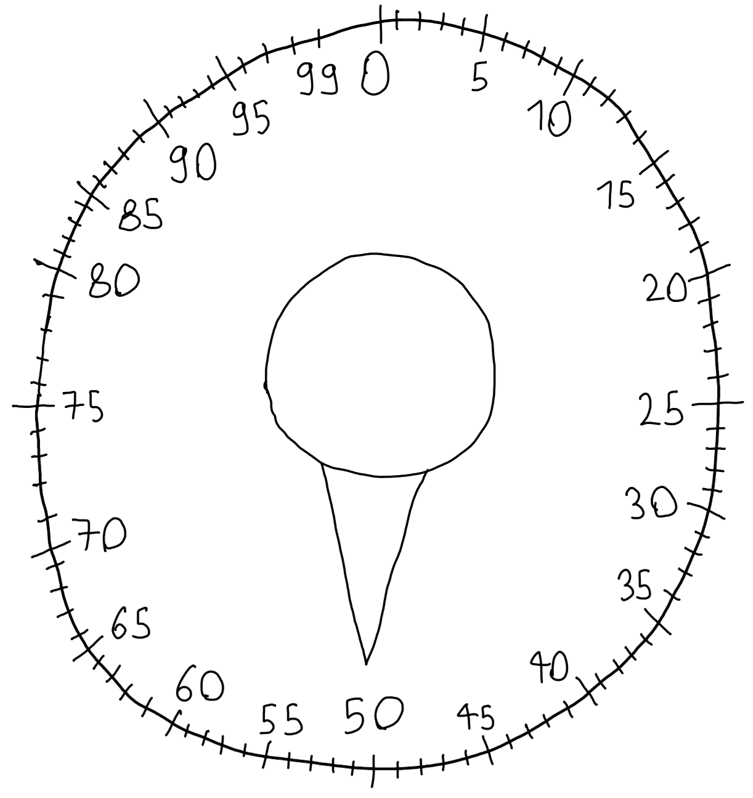

# Day 1 — Secret Entrance
## Counting Full Stops at Zero
The problem involves a safe with a dial marked $0$ through $99$. The dial can rotate clockwise and counterclockwise, producing a "click" at each number it passes. It may start at any position, however in this challenge it starts at 50.

<picture>
  <source media="(prefers-color-scheme: dark)" srcset="resources/dial_dark.png">
  <source media="(prefers-color-scheme: light)" srcset="resources/dial_light.png">
  
</picture>

The input provides a sequence of rotation instructions. Each instruction consists of a directional character, `L` (left, toward lower values) or `R` (right, toward higher values), followed by an integer representing the magnitude of the rotation.

Since the dial is circular, rotating left from $0$ by one click moves the dial to $99$. Similarly, rotating right from $99$ by one click moves it to $0$.

Consider an initial position of $50$ and the instruction sequence `R20`, `L75`, `R5`, `L30`, `R30`. The state transitions are calculated as follows

| Step | Instruction | Calculation | Position |
|------|-------------|-------------|----------|
| — | *(start)* | — | 50 |
| 1 | `R20` | 50 + 20 = 70 | 70 |
| 2 | `L75` | 70 − 75 = −5 → wraps to 95 | 95 |
| 3 | `R5` | 95 + 5 = 100 → wraps to **0** ✓ | **0** |
| 4 | `L30` | 0 − 30 = −30 → wraps to 70 | 70 |
| 5 | `R30` | 70 + 30 = 100 → wraps to **0** ✓ | **0** |

The objective is to count the number of times the dial rests on $0$ after a rotation. In this example, the dial reaches $0$ twice. Thus, the password is $2$.

## Normalizing the Dial Position
Inspection of the input file reveals that some instructions rotate the dial by more than a single full revolution (e.g., `R895`). Consequently, the implementation must account for the dial's wrap-around behavior.

Since only the resting position relative to $0$ is relevant, complete revolutions have no effect on the result. The dial has $100$ positions $[0, 99]$, thus one full revolution corresponds to exactly $100$ clicks. This value serves as the modulus used to normalize the dial position after each operation.

Directional instructions are mapped to arithmetic operations, `R` corresponds to addition and `L` corresponds to subtraction. Direct application of these operations can yield values outside the valid range. Thus the result must be normalized prior to its usage, This is handled by the following function

```rust
fn normalize_dial_position(pos: i32) -> i32 {
    (pos % FULL_ROTATION + FULL_ROTATION) % FULL_ROTATION
}
```

Let $P$ be the calculated position and $R$ be the full rotation length, which is $100$.

1. $P \bmod R$ (`pos % FULL_ROTATION`), yields a remainder in the interval $[-(R-1), R-1] = [-99, 99]$. Because this includes negative numbers, it can fall outside our valid dial interval of $[0, 99]$.
2. Adding $R$ (`+ FULL_ROTATION`) shifts the interval to $[1, 2R-1] = [1, 199]$. This maps negative numbers to their correct positive equivalent.
3. Finally, applying $\bmod R$ (`(...) % FULL_ROTATION`) again maps the result to the interval $[0, R - 1] = [0, 99]$

## Counting Zero Crossings
In this subsequent part, the objective shifts from counting only rotations that end at $0$ to counting the number of times the dial passes through zero during rotation.

Consider a sequence starting at 50 with the instructions `L60`, `R15`, `R200`

| Step | Instruction | Zero Crossings | Position |
|------|-------------|----------|----------------|
| — | *(start)* | — | 50 |
| 1 | `L60` | Sweeps left from 50 past 0 to 90. **(+1)** | 90 |
| 2 | `R15` | Sweeps right from 90 past 99→0 to 5. **(+1)** | 5 |
| 3 | `R200` | Two full revolutions from 5, each crossing 0. **(+2)** | 5 |

In this case, the dial passed through $0$ a total of $4$ times, so the password would be $4$.

## Decomposing Rotations into Revolutions and Remainder
The existing position update logic from the previous part can be retained. Only the counting logic needs to change. Each rotation is decomposed into two components, the **full revolutions** and a **remainder**.

**Full revolutions**: Every complete revolution of 100 clicks crosses 0 exactly once, regardless of the starting position. The count of full revolutions is simply `instruction.turns / FULL_ROTATION` and is added directly to the counter.

**Remainder**: After accounting for full revolutions, the remaining clicks (`instruction.turns % FULL_ROTATION`) might cause one additional crossing. This is detected by comparing the dial position before and after applying the remainder and crucially, before normalization is applied

```rust
if prev_dial_pos > LOWER_BOUNDARY && prev_dial_pos < FULL_ROTATION
	&& (curr_dial_pos <= LOWER_BOUNDARY || curr_dial_pos >= FULL_ROTATION)
	{
		count += 1;
	}
```

The initial conditions (`prev_dial_pos > LOWER_BOUNDARY && prev_dial_pos < FULL_ROTATION`) ensure the dial did not originate at $0$. This constraint is necessary to count transitions toward $0$, rather than transitions away from 0. The final condition evaluates whether the unnormalized result has fallen below $0$ or exceeded $99$, which signifies that the dial swept through the boundary.

This logic yields at most one additional crossing because, after removing the full revolutions, the remainder is strictly less than $100$. Therefore, the dial can wrap around the boundary at most once. For example, if the dial is at $1$ and rotates left by $99$ (the maximum possible remainder), the unnormalized position is $−98$, which normalizes to $2$, crossing $0$ exactly once. The same logic holds symmetrically for rightward rotations from $99$. After performing this check, the position is normalized and the process repeats for the subsequent instruction until the final password is determined.

[Go to Day 1 Code](../src/days/day01.rs)  
[Go to Day 2](day02.md)